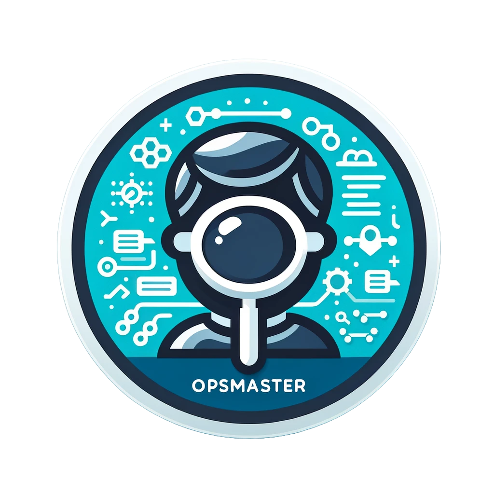

# obsburger

**ObsBurger** - Elastic Observability AI Assistant 

**OpsHuman** - Level 1 Operations (Definitely) Human

**OpsExpert** - Level 3 Super Expert in All things Elastic and Observability

  

`@opshuman shiftstart in June 2022, were there any anomalies related to APM services?`

`@opshuman naptime`

`@opsexpert shiftstart in June 2022, were there any anomalies related to APM services?`

Demo of 2 LLMs talking to eachother - The future is fun. Click for mp4 link.

[what runs through my head watching two bots talk to eachother](https://www.youtube.com/watch?v=9jy3WRbcB9k&ab_channel=DocRockwell)
